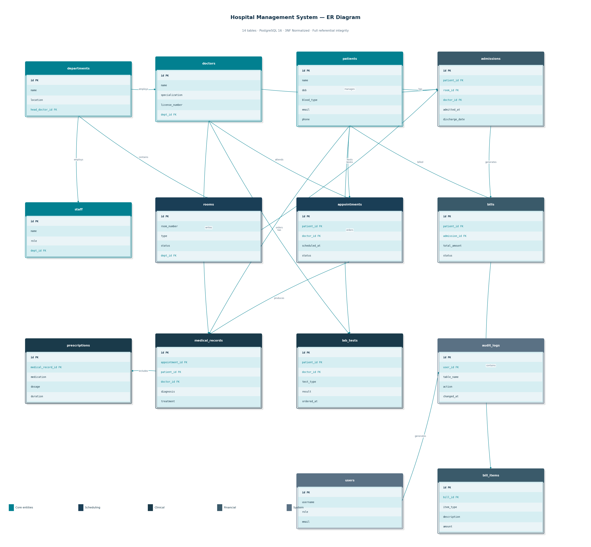

# 🏥 Hospital Management System
### Database Systems — Final Project | AUCA Spring 2026

**Student:** Aidai Mamyrova  
**Submitted:** May 9, 2026  
**Database:** PostgreSQL 16  
**GitHub:** [github.com/aidaimamyrova/hospital_management](https://github.com/aidaimamyrova/hospital_management)

---

## Table of Contents

1. [Project Description](#project-description)
2. [Problem It Solves](#problem-it-solves)
3. [Database Design](#database-design)
4. [Constraints & Normalization](#constraints--normalization)
5. [Tech Stack](#tech-stack)
6. [Setup & Run Instructions](#setup--run-instructions)
7. [Sample Queries](#sample-queries)
8. [Stored Procedures & Transactions](#stored-procedures--transactions)
9. [Views](#views)
10. [Backup & Restore](#backup--restore)
11. [Demo Video](#demo-video)

---

## Project Description

A complete relational database system designed to manage core hospital operations. The system handles patient records, doctor appointments, hospital admissions, billing, prescriptions, laboratory tests, and staff — all in a single normalized PostgreSQL database with full referential integrity.

This project was built as the final deliverable for the Database Systems course at AUCA, demonstrating real-world application of relational modeling, SQL, PL/pgSQL, and database administration practices.

---

## Problem It Solves

| Problem | How This System Solves It |
|---|---|
| Manual, error-prone record-keeping | Structured tables with NOT NULL and CHECK constraints enforce data quality |
| No centralized patient history | `medical_records`, `prescriptions`, and `lab_tests` all link to a single `patients` record |
| Appointment scheduling conflicts | `book_appointment()` procedure checks for conflicts before inserting, with automatic ROLLBACK |
| No real-time room availability | `rooms.status` is updated atomically during admission and discharge |
| Billing calculation errors | `discharge_patient()` calculates totals automatically from `bill_items` via PL/pgSQL |
| No accountability for data changes | `audit_logs` table records every modification with user ID and timestamp |

---

## Database Design

### ER Diagram



> *Entities in teal are core records. Arrows represent foreign key relationships. All 14 tables participate in referential integrity chains.*

---

### Schema — 14 Tables

| Table | Description | Key Relationships |
|---|---|---|
| `departments` | Hospital departments (ICU, Surgery, etc.) | Referenced by `doctors`, `rooms`, `staff` |
| `doctors` | Medical staff profiles and specializations | Belongs to `departments`; linked to `appointments`, `medical_records` |
| `patients` | Registered patient demographics and contact info | Central entity — linked to appointments, admissions, bills, records |
| `appointments` | Scheduled patient-doctor visits | References `patients`, `doctors` |
| `medical_records` | Diagnoses, treatments, and clinical notes | References `appointments`, `patients`, `doctors` |
| `prescriptions` | Medications ordered per medical record | References `medical_records` |
| `rooms` | Hospital rooms and bed availability | References `departments`; linked to `admissions` |
| `admissions` | Patient inpatient stays | References `patients`, `rooms`, `doctors` |
| `bills` | Invoice per patient stay or visit | References `patients`, `admissions` |
| `bill_items` | Individual line items on a bill | References `bills` |
| `lab_tests` | Laboratory orders and results | References `patients`, `doctors` |
| `staff` | Non-doctor hospital personnel | References `departments` |
| `users` | System login credentials and roles | Role-based access control |
| `audit_logs` | Complete change history for all tables | References `users` |

---

### Key Relationships

```
patients ──< appointments >── doctors ──< departments
patients ──< admissions >── rooms ──< departments
patients ──< bills ──< bill_items
patients ──< medical_records ──< prescriptions
patients ──< lab_tests
users ──< audit_logs
```

---

## Constraints & Normalization

### Normalization — 3NF Compliant

- **1NF** — All columns hold atomic values; no repeating groups
- **2NF** — Every non-key column depends on the whole primary key (no partial dependencies)
- **3NF** — No transitive dependencies; each column depends only on the primary key

### Constraints Applied

```sql
-- Primary keys on all 14 tables
-- Foreign keys with ON DELETE / ON UPDATE rules
-- CHECK constraints
ALTER TABLE patients ADD CONSTRAINT chk_blood_type
  CHECK (blood_type IN ('A+','A-','B+','B-','AB+','AB-','O+','O-'));

ALTER TABLE appointments ADD CONSTRAINT chk_status
  CHECK (status IN ('scheduled','completed','cancelled','no_show'));

ALTER TABLE rooms ADD CONSTRAINT chk_room_status
  CHECK (status IN ('available','occupied','maintenance'));

-- UNIQUE constraints
ALTER TABLE patients ADD CONSTRAINT uq_patient_email UNIQUE (email);
ALTER TABLE doctors  ADD CONSTRAINT uq_license       UNIQUE (license_number);
ALTER TABLE users    ADD CONSTRAINT uq_username      UNIQUE (username);

-- NOT NULL on all required fields
-- B-tree indexes on all foreign keys and frequent query columns
CREATE INDEX idx_appointments_patient ON appointments(patient_id);
CREATE INDEX idx_appointments_doctor  ON appointments(doctor_id);
CREATE INDEX idx_admissions_room      ON admissions(room_id);
CREATE INDEX idx_medical_records_appt ON medical_records(appointment_id);
```

---

## Tech Stack

| Component | Technology |
|---|---|
| Database | PostgreSQL 16 |
| Procedural language | PL/pgSQL |
| Query language | SQL (DDL, DML, window functions, CTEs) |
| CLI client | psql |
| GUI client | pgAdmin |
| Backup tool | pg_dump / pg_restore |
| Automation | Bash scripting |
| Version control | Git / GitHub |
| OS | macOS (also compatible with Linux and Windows WSL) |

---

## Setup & Run Instructions

### Prerequisites

- PostgreSQL 16 installed and running
- `psql` available in your terminal
- The repository cloned locally:

```bash
git clone https://github.com/aidaimamyrova/hospital_management.git
cd hospital_management
```

---

### Step 1 — Create the Database

```bash
psql -U postgres -c "CREATE DATABASE hospital_db;"
```

---

### Step 2 — Run the Schema

This creates all 14 tables, constraints, and indexes:

```bash
psql -U postgres -d hospital_db -f sql/schema.sql
```

---

### Step 3 — Seed Sample Data

Populate the database with realistic test records:

```bash
psql -U postgres -d hospital_db -f sql/seed_data.sql
```

---

### Step 4 — Load Stored Procedures & Views

```bash
psql -U postgres -d hospital_db -f sql/procedures.sql
psql -U postgres -d hospital_db -f sql/views.sql
```

---

### Step 5 — Verify Setup

```bash
psql -U postgres -d hospital_db
```

```sql
-- Check all tables exist
\dt

-- Check row counts
SELECT 'patients'     AS tbl, COUNT(*) FROM patients
UNION ALL
SELECT 'doctors',              COUNT(*) FROM doctors
UNION ALL
SELECT 'appointments',         COUNT(*) FROM appointments;
```

---

### Connecting with pgAdmin

1. Open pgAdmin → Add New Server
2. Host: `localhost` | Port: `5432`
3. Database: `hospital_db` | Username: `postgres`

---

## Sample Queries

### Basic Queries

**1. Find all patients with a specific blood type**
```sql
SELECT name, dob, phone, blood_type
FROM patients
WHERE blood_type = 'O+';
```

**2. List all appointments with patient and doctor names (3-table JOIN)**
```sql
SELECT
  p.name        AS patient,
  d.name        AS doctor,
  a.scheduled_at,
  a.status
FROM appointments a
JOIN patients p ON a.patient_id = p.id
JOIN doctors  d ON a.doctor_id  = d.id
ORDER BY a.scheduled_at DESC;
```

**3. Count appointments per department (GROUP BY)**
```sql
SELECT
  dept.name             AS department,
  COUNT(a.id)           AS total_appointments
FROM appointments a
JOIN doctors     d    ON a.doctor_id  = d.id
JOIN departments dept ON d.dept_id   = dept.id
GROUP BY dept.name
ORDER BY total_appointments DESC;
```

**4. Distinct patients seen in the last 30 days**
```sql
SELECT DISTINCT p.id, p.name
FROM patients p
JOIN appointments a ON p.id = a.patient_id
WHERE a.scheduled_at >= NOW() - INTERVAL '30 days'
  AND a.status = 'completed';
```

---

### Advanced Queries

**5. Most recent appointment per patient (Window Function)**
```sql
SELECT
  patient_id,
  doctor_id,
  scheduled_at,
  ROW_NUMBER() OVER (
    PARTITION BY patient_id
    ORDER BY scheduled_at DESC
  ) AS visit_rank
FROM appointments;
-- Filter to visit_rank = 1 to get each patient's latest visit
```

**6. Top doctors by appointment volume (CTE + RANK)**
```sql
WITH doctor_stats AS (
  SELECT doctor_id, COUNT(*) AS total
  FROM appointments
  GROUP BY doctor_id
)
SELECT
  d.name,
  ds.total,
  RANK() OVER (ORDER BY ds.total DESC) AS ranking
FROM doctor_stats ds
JOIN doctors d ON ds.doctor_id = d.id;
```

**7. Billing breakdown by category (CASE pivot)**
```sql
SELECT
  b.id AS bill_id,
  SUM(CASE WHEN bi.item_type = 'consultation' THEN bi.amount ELSE 0 END) AS consultation_fee,
  SUM(CASE WHEN bi.item_type = 'lab'          THEN bi.amount ELSE 0 END) AS lab_fee,
  SUM(CASE WHEN bi.item_type = 'medication'   THEN bi.amount ELSE 0 END) AS medication_fee,
  SUM(bi.amount)                                                          AS total
FROM bills b
JOIN bill_items bi ON b.id = bi.bill_id
GROUP BY b.id;
```

---

### Screenshots

> *Add screenshots of query output from psql or pgAdmin here.*

  
  


---

## Stored Procedures & Transactions

All three procedures use explicit `BEGIN … COMMIT` with `ROLLBACK` on failure, ensuring the database never ends up in a partial state.

---

### `book_appointment(patient_id, doctor_id, scheduled_at)`

Checks for scheduling conflicts before inserting. Rolls back automatically if the doctor is already booked at that time.

```sql
CALL book_appointment(1, 3, '2026-05-15 10:00:00');
```

**Flow:**
1. BEGIN
2. Lock the doctor's schedule for the requested time slot
3. Query for any existing appointment in the same window
4. RAISE EXCEPTION → ROLLBACK if conflict found
5. INSERT new appointment
6. COMMIT

---

### `admit_patient(patient_id, room_id, doctor_id, admission_date)`

Checks room availability before admission. Atomically inserts the admission record and updates room status.

```sql
CALL admit_patient(1, 204, 3, NOW());
```

**Flow:**
1. BEGIN
2. SELECT room status — verify it is `'available'`
3. RAISE EXCEPTION → ROLLBACK if room is `'occupied'`
4. INSERT into `admissions`
5. UPDATE `rooms SET status = 'occupied'`
6. COMMIT

---

### `discharge_patient(admission_id)`

Calculates the full bill from all `bill_items`, creates the invoice, releases the room, and closes the admission record — all in one atomic operation.

```sql
CALL discharge_patient(42);
```

**Flow:**
1. BEGIN
2. Fetch all `bill_items` associated with the admission
3. Compute the total amount
4. INSERT into `bills` and `bill_items`
5. UPDATE `rooms SET status = 'available'`
6. UPDATE `admissions SET discharge_date = NOW()`
7. COMMIT

---

## Views

Pre-built views simplify reporting and hide complex join logic from the application layer.

| View | Purpose |
|---|---|
| `patient_summary` | Patient name, DOB, blood type, and most recent visit |
| `doctor_performance` | Appointment counts, completion rates, and patient load per doctor |
| `appointment_summary` | Full appointment details joined across patients, doctors, and departments |
| `current_admissions` | All currently admitted patients with room number and attending doctor |
| `billing_summary` | Total bill amount, amount paid, and outstanding balance per patient |
| `lab_test_summary` | All lab orders with test type, ordering doctor, and result status |

**Example — check current admissions:**
```sql
SELECT * FROM current_admissions;
```

**Example — review unpaid bills:**
```sql
SELECT patient, total_amount, balance
FROM billing_summary
WHERE balance > 0
ORDER BY balance DESC;
```

---

## Backup & Restore

### Automated Backup

The `backup.sh` script creates a compressed, timestamped backup and automatically removes backups older than the 7 most recent.

```bash
chmod +x scripts/backup.sh
./scripts/backup.sh
```

Backups are saved as: `backups/hospital_YYYYMMDD_HHMMSS.sql.gz`

**What the script does:**
1. Runs `pg_dump` with compression
2. Names the file with the current timestamp
3. Lists existing backups sorted by date
4. Deletes any beyond the 7 most recent
5. Logs the run with timestamp and file size

---

### Interactive Restore

```bash
chmod +x scripts/restore.sh
./scripts/restore.sh
```

The restore script:
1. Lists all available `.sql.gz` backups with dates
2. Prompts you to select one by number
3. Asks for confirmation before proceeding
4. Drops and recreates `hospital_db` from the selected dump

> ⚠️ Restore is a destructive operation. Always confirm you have selected the correct backup before proceeding.

---

## Demo Video

📹 [Watch the project demo on Google Drive](https://drive.google.com/drive/u/1/folders/1-XyCQeSQkAwn-E39tlt4pOM8leRXXY5F)

The demo covers:
- Live database setup from schema to seed data
- Running basic and advanced queries in psql
- Calling `book_appointment()` and triggering a rollback on conflict
- Calling `discharge_patient()` and viewing the generated bill
- Querying the views and audit log

---

## Author

**Aidai Mamyrova**  
American University of Central Asia (AUCA)  
Database Systems — Spring 2026
